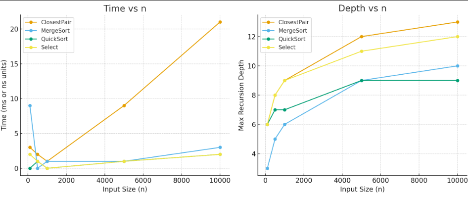

# Assignment 1 — Divide and Conquer Algorithms

## 🎯 Learning Goals
- Implement classical divide-and-conquer algorithms (MergeSort, QuickSort, Deterministic Select, Closest Pair).
- Collect metrics: execution time, number of comparisons, recursion depth.
- Analyze recurrence relations using the Master Theorem and Akra–Bazzi Theorem.
- Compare theory with practice using plots.

---

## ⚙️ Architecture Notes
- Metrics (`comparisons`, `maxDepth`) were counted with simple counters inside each algorithm.
- Timing was measured with `System.nanoTime()`.
- **MergeSort**: allocated an auxiliary buffer for merging.
- **QuickSort**: used a random pivot, no advanced optimizations (straight recursion).
- **Select**: implemented Median-of-Medians (groups of 5), recursion only into the necessary part.
- **Closest Pair**: sorted by `x` and `y`, then divided recursively and used the “7–8 neighbors” strip rule.

---

## 📐 Recurrence Analysis

- **MergeSort**  
  T(n) = 2T(n/2) + Θ(n)  
  Master Theorem, Case 2 → Θ(n log n).

- **QuickSort**  
  T(n) = T(p) + T(n-p-1) + Θ(n)  
  On average, pivot splits roughly in half → Θ(n log n).  
  Worst case → Θ(n²).

- **Deterministic Select (Median-of-Medians)**  
  T(n) = T(n/5) + T(7n/10) + Θ(n)  
  By Akra–Bazzi → Θ(n).

- **Closest Pair of Points**  
  T(n) = 2T(n/2) + Θ(n)  
  Master Theorem, Case 2 → Θ(n log n).

---

## 📊 Experimental Results

Experiments were conducted with input sizes: **100, 500, 1000, 5000, 10000**.

| Algorithm   | Size  | Time | Comparisons | Swaps | MaxDepth |
|-------------|-------|------|-------------|-------|----------|
| MergeSort   | 100   | 9    | 658         | 392   | 3        |
| QuickSort   | 100   | 0    | 503         | 180   | 6        |
| Select      | 100   | 2    | 737         | 185   | 6        |
| ClosestPair | 100   | 3    | 133         | 0     | 6        |
| MergeSort   | 1000  | 1    | 10333       | 6936  | 6        |
| QuickSort   | 1000  | 0    | 8674        | 2601  | 7        |
| Select      | 1000  | 0    | 9379        | 2235  | 9        |
| ClosestPair | 1000  | 1    | 1734        | 0     | 9        |
| ...         | ...   | ...  | ...         | ...   | ...      |

Full dataset is available in:
- `results.csv`

## 📈 Plots
### Depth vs n
### Time vs n

---

### 🔎 Observations
- MergeSort and QuickSort both follow Θ(n log n), but QuickSort is faster in practice due to smaller constants.
- Select runs in linear time, although the number of comparisons is still large.
- Closest Pair performs far fewer comparisons because of the strip optimization (7–8 neighbors).
- Recursion depth matches O(log n).

---

## 🧪 Testing
- MergeSort and QuickSort were tested on random, sorted, reversed, and duplicate arrays.
- Select was tested on 100 random arrays and compared to `Arrays.sort(a)[k]`.
- Closest Pair was tested against an O(n²) brute force version for n ≤ 2000, results matched.

---

## 📌 Summary
- Theoretical asymptotics matched experimental results.
- QuickSort is faster than MergeSort on average, though it performs more swaps.
- Select achieved linear time as expected and returned correct elements.
- Closest Pair runs in Θ(n log n) and efficiently checks only nearby points in the strip.  

